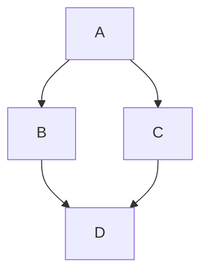

## Markdown Basic Syntax

这篇文章包含markdown语法基本的内容, 目的是放在自己的博客园上, 通过开发者控制台快速选中,
从而自定义自己博客园markdown样式.当然本文也可以当markdown语法学习之用.

在markdown里强制换行是在末尾添加2个空格+1个回车.
在markdown里可以使用 \ 对特殊符号进行转义.

# 1. 标题

**语法**

```
# This is an <h1> tag
## This is an <h2> tag
### This is an <h3> tag
#### This is an <h4> tag
```

**实例**

# This is an h1 tag

## This is an h2 tag

### This is an h3 tag

#### This is an h4 tag

# 2. 强调和斜体

**语法**

```
*This text will be italic*
_This will also be italic_

**This text will be bold**
__This will also be bold__
```

(个人不喜欢2个下划线中间包含的内容被斜体, 会和网址冲突, 我会在自定义博客园样式中去除这个样式.)

**实例**

*This text will be italic*
_This will also be italic_

**This text will be bold**
__This will also be bold__

# 3. 有序列表和无序列表

**语法**

```
* Item 1
* Item 2
* Item 3

1. Item 1
2. Item 2
3. Item 3
```

**实例**

* Item 1
* Item 2
* Item 3

1. Item 1
2. Item 2
3. Item 3

# 4. 图片

**语法**

```

```

**实例**


# 5. 超链接

**语法**

```
[link-name](link-url)
```

**实例**

[阿胜4K](http://www.cnblogs.com/asheng2016/)

# 6. 引用

**语法**

```
> 引用本意是引用别人的话之类  
> 但我个人喜欢把引用当成"注意"使用  
```

**实例**

> If you please draw me a sheep!
> 不想当将军的士兵, 不是好士兵.

# 7. 单行代码

**语法**

```
`This is an inline code.`
```

**实例**

`同样的单行代码, 我经常用来显示特殊名词`

# 8. 多行代码

**语法**

````
```javascript
for (var i=0; i<100; i++) {
    console.log("hello world" + i);
}
```
````

**实例**

```js
for (var i=0; i<100; i++) {
    console.log("hello world" + i);
}
```

也可以通过缩进来显示代码, 下面是示例:

    console.loe("Hello_World");

# 参考链接

https://guides.github.com/features/mastering-markdown/
https://help.github.com/articles/basic-writing-and-formatting-synta

I just love **bold text**. Italicized text is the _cat's meow_. At the command prompt, type `nano`.

My favorite markdown editor is [ByteMD](https://github.com/bytedance/bytemd).

1. First item
2. Second item
3. Third item

> Dorothy followed her through many of the beautiful rooms in her castle.

```js
import gfm from "@bytemd/plugin-gfm";
import { Editor, Viewer } from "bytemd";

const plugins = [
  gfm(),
  // Add more plugins here
];

const editor = new Editor({
  target: document.body, // DOM to render
  props: {
    value: "",
    plugins,
  },
});

editor.on("change", (e) => {
  editor.$set({ value: e.detail.value });
});
```

## GFM Extended Syntax

Automatic URL Linking: https://github.com/bytedance/bytemd

~~The world is flat.~~ We now know that the world is round.

- [X] Write the press release
- [ ] Update the website
- [ ] Contact the media

| Syntax    | Description |
| --------- | ----------- |
| Header    | Title       |
| Paragraph | Text        |

## Footnotes

Here's a simple footnote,[^1] and here's a longer one.[^bignote]

## Gemoji

Thumbs up: 👍, thumbs down: 👎.

Families: 👨‍👨‍👦‍👦

Long flags: :wales:, :scotland:, :england:.

## Math Equation

Inline math equation: $a+b$

$$
\displaystyle \left( \sum_{k=1}^n a_k b_k \right)^2 \leq \left( \sum_{k=1}^n a_k^2 \right) \left( \sum_{k=1}^n b_k^2 \right)
$$

## Mermaid Diagrams



[^1]: This is the first footnote.
    
[^bignote]: Here's one with multiple paragraphs and code.
    
       Indent paragraphs to include them in the footnote.
    
       `{ my code }`
    
       Add as many paragraphs as you like.
